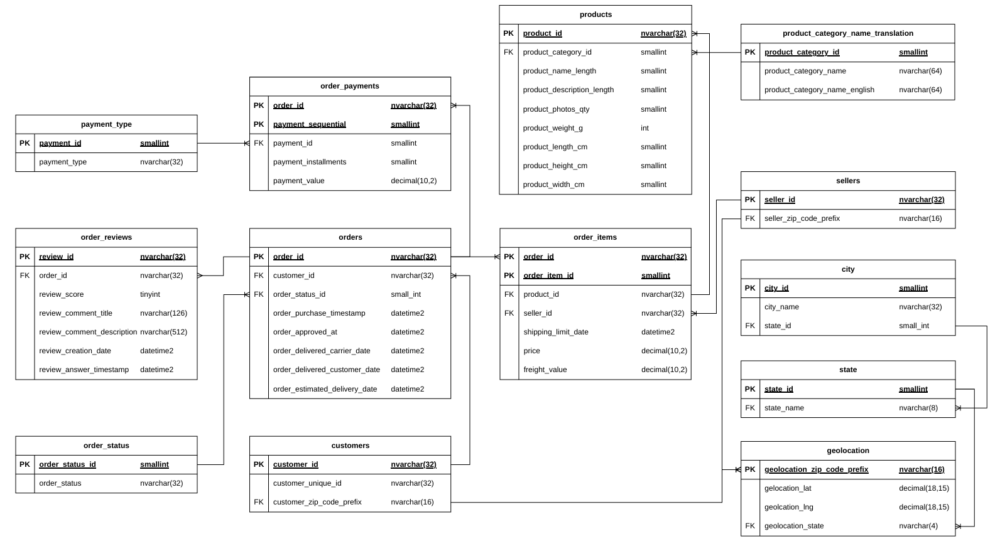
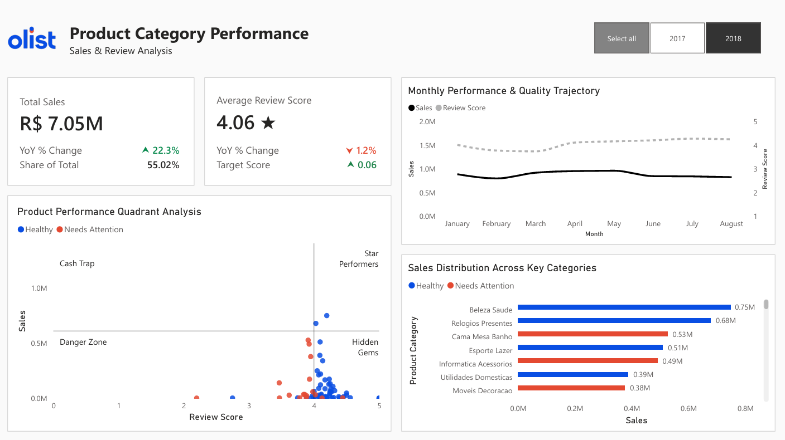
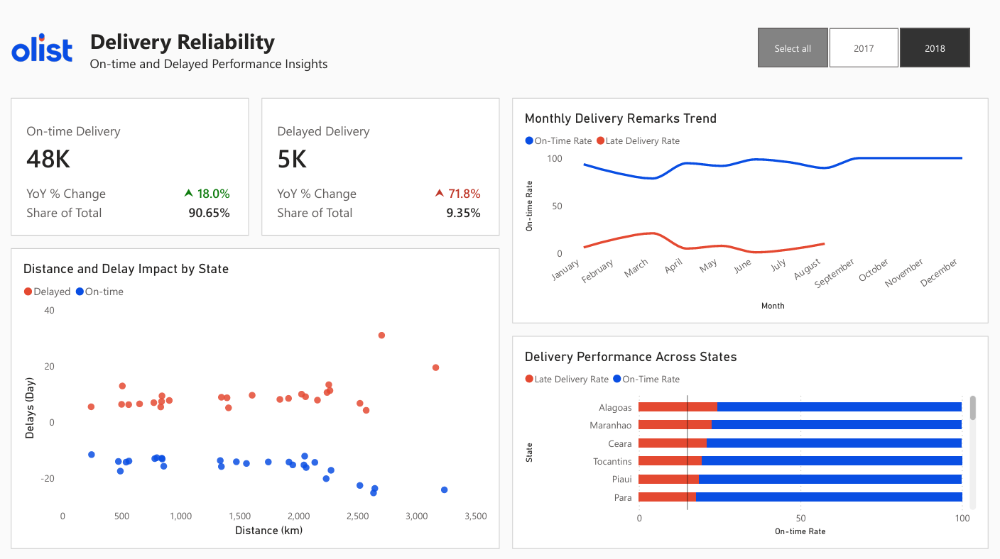

# Olist E-Commerce Analytics

> An end-to-end data project covering ETL, database design, and a Power BI dashboard to explore product performance and delivery reliability in Olist’s Brazilian marketplace.

## Table of Contents

1. [Executive Summary](#1-executive-summary)
2. [Background](#2-background)
3. [Objectives](#3-objectives)
4. [Data Description & ERD](#4-data-description--erd)
5. [Data Ingestion](#5-data-ingestion)
6. [Insight Deep Dive](#6-insight-deep-dive)
7. [Power BI Dashboard](#7-power-bi-dashboard)
8. [Recommendations](#8-recommendations)

## 1. Executive Summary

This project analyzes Olist's Brazilian e-commerce dataset to surface operational insights across two dimensions: product quality and delivery reliability. Over the 2017–2018 period, total sales reached R$12.81M with an average review score of 4.09/5.00. While 52 product categories are classified as healthy and 18 need attention, three high-revenue categories in the "Cash Trap" quadrant—Cama Mesa Banho, Informatica Acessorios, and Moveis Decoracao—collectively account for 20% of total sales while consistently scoring below the platform average, representing a significant retention risk. Olist should prioritize seller quality control and customer feedback analysis in these categories to protect long-term revenue.

On delivery, 91.88% of orders arrive on time, indicating that overall performance meets expectations; however, northeastern states remain disproportionately affected. Alagoas records only a 75% on-time rate, Maranhão at 80%, and Piauí at 84%, highlighting regional inefficiencies. Operations should focus on improving logistics and last-mile delivery performance in these areas to close the service gap.

## 2. Background

Olist released this dataset on [Kaggle](https://www.kaggle.com/datasets/olistbr/brazilian-ecommerce) with a specific framing - they highlighted delivery performance, customer reviews, and product categories as the intended analytical dimensions. Rather than treating these as reporting categories, I asked what a product or operations manager at Olist would actually need to decide, and sharpened each dimension into a real business tension. The goal was to produce analysis that could directly inform a prioritization call, not just describe what the data contains.

## 3. Objectives

This project is scoped around two operational tensions a product or operations manager at Olist would actually face:

### 3.1 Category Performance
- Which product categories drive the most revenue, and which ones are quietly damaging the customer experience? When a high-revenue category consistently earns low ratings, what should Olist do about it?

### 3.2 Delivery Reliability
- Is Olist's delivery promise actually holding up against customer expectations? Where are the biggest gaps between estimated and actual delivery, and which regions should operations fix first?

## 4. Data Description & ERD

The original dataset ships as nine flat CSV files covering customers, orders, order items, payments, reviews, products, sellers, product category translations, and geolocation. Out of the box, these files are denormalized - entity attributes are scattered, city names are inconsistent, and there are no enforced relationships between tables.

| File | Description |
|---|---|
| `olist_customers_dataset.csv` | Customer ID, city, state |
| `olist_orders_dataset.csv` | Order lifecycle timestamps and status |
| `olist_order_items_dataset.csv` | Line-item detail per order |
| `olist_order_payments_dataset.csv` | Payment type and installment data |
| `olist_order_reviews_dataset.csv` | Review scores and timestamps |
| `olist_products_dataset.csv` | Product attributes and dimensions |
| `olist_sellers_dataset.csv` | Seller location data |
| `olist_product_category_name_translation.csv` | Portuguese-to-English category mapping |
| `olist_geolocation_dataset.csv` | ZIP-code-level lat/long coordinates |

After normalization, the schema expanded to **13 tables** with proper lookup tables, foreign key constraints, and clear entity separation.

### Entity Relationship Diagram

## 5. Data Ingestion

Before any analysis could begin, the dataset was redesigned for reliability - from a flat file structure into a normalized relational model with automated quality checks at every stage.

### Database Normalization

The nine source CSVs were restructured into a relational schema with proper lookup tables, foreign key constraints, and clear separation of entities. This eliminated redundancy and enforced consistent relationships across all transactional data.

### Python ETL Pipeline

The pipeline goes beyond simple file ingestion. Key quality controls built in:

- **Unicode standardization** - city names are normalized to remove encoding artifacts before loading
- **Type validation** — strict data type enforcement with logged failure counts per column
- **Financial constraints** - non-negative checks applied to all monetary fields
- **Geolocation filtering** - records outside Brazil's bounding box are flagged and excluded
- **Referential integrity** - foreign key violations are counted, explained, and written to timestamped audit logs rather than silently dropped

> Full pipeline source: [`data_ingestion.py`](python\data_ingestion.py)

### QA Drop Report

After processing, the pipeline generates a structured QA report. Key findings:

- Drop rates remained below 1% across all 13 tables
- 811 duplicate review IDs resolved by retaining the latest record per order
- Full foreign key chain validated: `customers → orders → order_items`
- Final row counts align with expected dataset sizes, confirming data completeness

> QA report source: [`qa_report`](qa_report)

## 6. Insight Deep Dive

### 6.1 Category Performance

The portfolio generated **R$12.81M** in total sales across 2017–2018, with an overall average review score of **4.09/5.00**. Of the 70 product categories analyzed, **52 are classified as healthy** and **18 need attention**.

#### Star Performers (High Revenue, Strong Reviews)

These categories represent the strongest value drivers, accounting for **26% of total sales** with a **4.14/5.00 average rating**:

| Category              | Sales   | Avg Review Score |
|----------------------|--------:|------------------|
| Beleza Saude         | R$1.22M | 4.19★           |
| Relogios Presentes   | R$1.15M | 4.07★           |
| Esporte Lazer        | R$941K  | 4.17★           |

These categories combine scale and customer satisfaction, making them ideal candidates for **continued investment, promotion, and assortment expansion**.

#### Cash Traps (High Revenue, Low Reviews)

These categories represent a critical risk, contributing **20% of total sales** but averaging only **3.96/5.00**:

| Category                  | Sales   | Avg Review Score |
|----------------------------|--------:|------------------|
| Cama Mesa Banho           | R$1.01M | 3.93★           |
| Informatica Acessorios    | R$876K  | 3.99★           |
| Moveis Decoracao          | R$695K  | 3.96★           |

These categories generate strong revenue today while quietly accumulating customer dissatisfaction, which can suppress repeat purchases and long-term retention.

The remaining 49 healthy categories fall into the Hidden Gems quadrant (lower revenue, strong reviews), representing opportunities for growth through visibility and marketing, while 15 underperforming categories sit in the Danger Zone(low revenue, low reviews).

> SQL analysis: [`category_performance.sql`](sql\category_performance.sql)

---

### 6.2 Delivery Reliability

**Business question:** Is Olist's delivery promise holding up, and where are the biggest gaps?

Across 2017–2018, 91.88% of deliveries (88K orders) arrived on time, while 8.12% (8K orders) were delayed. While the overall performance meets expectations, this headline metric masks significant regional disparities.

#### Regional Gaps

Northeastern states are the primary gap drivers, with consistently lower on-time rates:

- **Alagoas** - 75%  
- **Maranhão** - 81%  
- **Piauí** - 84%

This indicates that Olist’s delivery promise is not consistently upheld across regions, creating uneven customer experiences.

#### Delivery Insights

- There is a moderate positive relationship between distance and delay severity for late shipments  
- The highest risk occurs at distances above 2,500 km, where delays become more extreme  
- However, on-time deliveries remain stable across all distances

This suggests that distance alone is not the root cause.

> SQL analysis: [`delivery_reliability.sql`](sql\delivery_reliability.sql)

## 7. Power BI Dashboard

The dashboard is split into two pages, each mapped to one analytical objective.

### Page 1 - Product Category Performance

### Page 2 — Delivery Reliability

> Dashboard file: [`olist_ecommerce.pbix`](data_dashboard/olist_ecommerce.pbix)

## 8. Recommendations

### Category Performance

**1. Conduct targeted seller quality audits in high-risk categories**  
Cama Mesa Banho, Informatica Acessorios, and Moveis Decoracao collectively represent 20% of platform sales but consistently score below the platform average. Olist should prioritize seller-level audits within the bottom quartile of review scores in these categories to identify root causes—whether driven by product quality, misleading listings, or fulfillment issues.

**2. Implement category-level review score thresholds**  
To shift from reactive to proactive quality management, Olist should define minimum review score thresholds per category. Sellers falling below this threshold should trigger:
- Automated warnings  
- Reduced visibility  
- Potential inventory suppression  

This creates a systematic quality control mechanism that protects customer experience at scale.

---

### Delivery Reliability

**1. Prioritize logistics improvements in underperforming regions**  
Northeastern states—particularly Alagoas (75% on-time), Maranhão (81%), and Piaui (84%), should be the primary focus for operational intervention.  
Key actions include:
- Establishing new last-mile carrier partnerships 
- Exploring regional fulfillment expansion 
- Incentivizing sellers to reduce shipment origination distance  

These efforts directly address the largest gaps in delivery performance.

**2. Recalibrate delivery time estimates by region**  
Where infrastructure improvements may take time, Olist can immediately improve customer experience through better expectation management. Adjusting delivery estimates in high-delay regions reduces the gap between promised and actual delivery times, helping protect review scores and customer trust.

**3. Investigate carrier-level performance for long-distance shipments**  
While delay severity increases beyond 2,500 km, on-time deliveries remain consistent at similar distances—indicating that distance alone is not the root cause.  

Olist should analyze carrier-level delay rates to identify underperforming logistics partners. If delays are concentrated among specific carriers, targeted actions, such as renegotiation, replacement, or route optimization, can deliver faster and more cost-effective improvements.